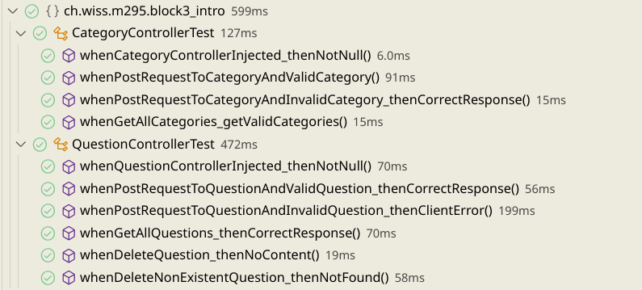

# WissQuizAPI
## Bledion/Max
## Assignment
here is the desired Screenshot of the Testing.

### Code of the testing
#### CategoryController Test
```java
package ch.wiss.m295.block3_intro;

import static org.assertj.core.api.Assertions.assertThat;
import static org.springframework.test.web.servlet.result.MockMvcResultMatchers.status;

import org.junit.jupiter.api.Test;
import org.junit.jupiter.api.extension.ExtendWith;
import org.springframework.beans.factory.annotation.Autowired;
import org.springframework.boot.test.autoconfigure.web.servlet.AutoConfigureMockMvc;
import org.springframework.boot.test.autoconfigure.web.servlet.WebMvcTest;
import org.springframework.boot.test.mock.mockito.MockBean;
import org.springframework.http.MediaType;
import org.springframework.test.context.junit.jupiter.SpringExtension;
import org.springframework.test.web.servlet.MockMvc;
import org.springframework.test.web.servlet.request.MockMvcRequestBuilders;
import org.springframework.test.web.servlet.result.MockMvcResultMatchers;
import static org.springframework.test.web.servlet.result.MockMvcResultMatchers.jsonPath;

import com.fasterxml.jackson.databind.ObjectMapper;

import ch.wiss.m295.block3_intro.controller.CategoryController;
import ch.wiss.m295.block3_intro.model.Category;
import ch.wiss.m295.block3_intro.repositories.AnswerRepository;
import ch.wiss.m295.block3_intro.repositories.CategoryRepository;
import ch.wiss.m295.block3_intro.repositories.QuestionRepository;


@ExtendWith(SpringExtension.class)
@WebMvcTest(controllers = CategoryController.class) // Only load the CategoryController
@AutoConfigureMockMvc
public class CategoryControllerTest {

    @MockBean
    private QuestionRepository questionRepository;

    @MockBean
    private CategoryRepository categoryRepository;

    @MockBean
    private AnswerRepository answerRepository;

    @Autowired
    private CategoryController categoryController; // SUT - System Under Test

    @Autowired
    private MockMvc mockMvc; // Used for making requests to your controllers

    @Test
    public void whenCategoryControllerInjected_thenNotNull() throws Exception {
        assertThat(categoryController).isNotNull(); // Check if SUT is loaded properly
    }
    @Test
    public void whenPostRequestToCategoryAndValidCategory() throws Exception {
        Category requestCategory = new Category();
        requestCategory.setName("Test Category");
        String requestJson = new ObjectMapper().writeValueAsString(requestCategory);
        mockMvc.perform(MockMvcRequestBuilders.post("/category/")
        .contentType(MediaType.APPLICATION_JSON)
        .content(requestJson))
        .andExpect(status().isOk())
        .andExpect(jsonPath("$.name").value("Test Category"));
        
    }


    @Test
    public void whenPostRequestToCategoryAndInvalidCategory_thenCorrectResponse() throws Exception {
        // Invalid POST request with missing required data
        mockMvc.perform(MockMvcRequestBuilders.post("/category")
                .contentType(MediaType.APPLICATION_JSON)) // Specify JSON content type
                .andExpect(status().is4xxClientError()); // Expect HTTP 400 Bad Request
                //.andExpect(MockMvcResultMatchers.jsonPath("$.error").isNotEmpty()) // Expect error message
                //.andExpect(MockMvcResultMatchers.content().contentType(MediaType.APPLICATION_JSON));
    }

    @Test
    public void whenGetAllCategories_getValidCategories() throws Exception {
        mockMvc.perform(MockMvcRequestBuilders.get("/category/")
                .contentType(MediaType.APPLICATION_JSON))
                .andDo(res -> System.out.println(res.getResponse().getContentAsString())) // Print response
                .andExpect(status().isOk()) // Expect HTTP 200 OK
                .andExpect(MockMvcResultMatchers.content().contentType(MediaType.APPLICATION_JSON)); // Expect JSON content type
    }
}

 ```
 #### QuestionController Test
 ```java 
 package ch.wiss.m295.block3_intro;

import static org.assertj.core.api.Assertions.assertThat;
import static org.mockito.ArgumentMatchers.any;
import static org.mockito.Mockito.doNothing;
import static org.mockito.Mockito.times;
import static org.mockito.Mockito.verify;
import static org.mockito.Mockito.when;
import static org.springframework.test.web.servlet.result.MockMvcResultMatchers.status;
import static org.springframework.test.web.servlet.result.MockMvcResultMatchers.jsonPath;

import org.junit.jupiter.api.Test;
import org.junit.jupiter.api.extension.ExtendWith;
import org.springframework.beans.factory.annotation.Autowired;
import org.springframework.boot.test.autoconfigure.web.servlet.AutoConfigureMockMvc;
import org.springframework.boot.test.autoconfigure.web.servlet.WebMvcTest;
import org.springframework.boot.test.mock.mockito.MockBean;
import org.springframework.http.MediaType;
import org.springframework.test.context.junit.jupiter.SpringExtension;
import org.springframework.test.web.servlet.MockMvc;
import org.springframework.test.web.servlet.request.MockMvcRequestBuilders;
import org.springframework.test.web.servlet.result.MockMvcResultMatchers;

import com.fasterxml.jackson.databind.ObjectMapper;

import ch.wiss.m295.block3_intro.controller.QuestionController;
import ch.wiss.m295.block3_intro.model.Question;
import ch.wiss.m295.block3_intro.model.Category;
import ch.wiss.m295.block3_intro.repositories.QuestionRepository;
import ch.wiss.m295.block3_intro.repositories.CategoryRepository;
import ch.wiss.m295.block3_intro.repositories.AnswerRepository;

@ExtendWith(SpringExtension.class)
@WebMvcTest(controllers = QuestionController.class) 
@AutoConfigureMockMvc
public class QuestionControllerTest {

    @MockBean
    private QuestionRepository questionRepository;

    @MockBean
    private CategoryRepository categoryRepository;

    @MockBean
    private AnswerRepository answerRepository;

    @Autowired
    private QuestionController questionController; 

    @Autowired
    private MockMvc mockMvc; 

    @Test
    public void whenQuestionControllerInjected_thenNotNull() throws Exception {
        assertThat(questionController).isNotNull(); 
    }

    @Test
    public void whenPostRequestToQuestionAndValidQuestion_thenCorrectResponse() throws Exception {
        Question requestQuestion = new Question();
        requestQuestion.setQuestion("Was ist Java?");
        Category category = new Category();
        category.setId(1);
        category.setName("Programmierung");
        requestQuestion.setCategory(category);

        when(questionRepository.save(any(Question.class))).thenReturn(requestQuestion);

        String requestJson = new ObjectMapper().writeValueAsString(requestQuestion);

        // POST Request
        mockMvc.perform(MockMvcRequestBuilders.post("/questions/")
            .contentType(MediaType.APPLICATION_JSON)
            .content(requestJson))
            .andExpect(status().isCreated()) // HTTP 201 
            .andExpect(jsonPath("$.question").value("Was ist Java?"))
            .andExpect(jsonPath("$.category.name").value("Programmierung"));
}


    @Test
    public void whenPostRequestToQuestionAndInvalidQuestion_thenClientError() throws Exception {
        // Invalid POST Request
        mockMvc.perform(MockMvcRequestBuilders.post("/questions/")
                .contentType(MediaType.APPLICATION_JSON))
                .andExpect(status().is4xxClientError()); // HTTP 400
    }

    @Test
    public void whenGetAllQuestions_thenCorrectResponse() throws Exception {
        mockMvc.perform(MockMvcRequestBuilders.get("/questions/")
                .contentType(MediaType.APPLICATION_JSON))
                .andDo(res -> System.out.println(res.getResponse().getContentAsString())) 
                .andExpect(status().isOk()) //  HTTP 200 
                .andExpect(jsonPath("$").isArray()); 
    }
    @Test
    public void whenDeleteQuestion_thenNoContent() throws Exception {
        long questionId = 1;

        when(questionRepository.existsById(questionId)).thenReturn(true);
        mockMvc.perform(MockMvcRequestBuilders.delete("/questions/{id}", questionId))
                .andExpect(status().isNoContent()); // HTTP 204 

        verify(questionRepository, times(1)).deleteById(questionId);
    }

    @Test
    public void whenDeleteNonExistentQuestion_thenNotFound() throws Exception {
        long questionId = 1;

        when(questionRepository.existsById(questionId)).thenReturn(false);
        mockMvc.perform(MockMvcRequestBuilders.delete("/questions/{id}", questionId))
                .andExpect(status().isNotFound()); // HTTP 404
    }
}

 ```

